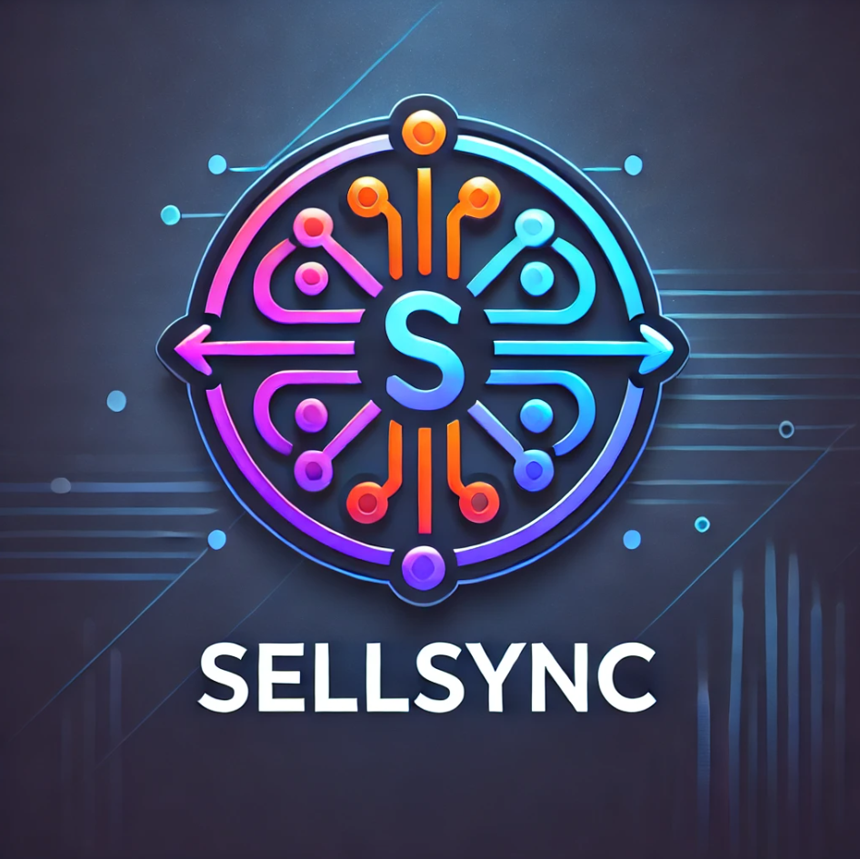

# SellSync - Gestão de Vendas e Estoque

Estou desenvolvendo um sistema de Gestão de Vendas e Estoque em Java, utilizando o NetBeans IDE com Maven para gerenciamento de dependências e o MySQL Workbench para modelagem e administração do banco de dados. O projeto incorpora bibliotecas como Reflections (para manipulação dinâmica de classes), Lombok (para simplificação do código) e MigLayout (para um layout flexível e responsivo). A aplicação visa oferecer uma solução eficiente, escalável e intuitiva para controle de produtos, pedidos e movimentação de estoque.
