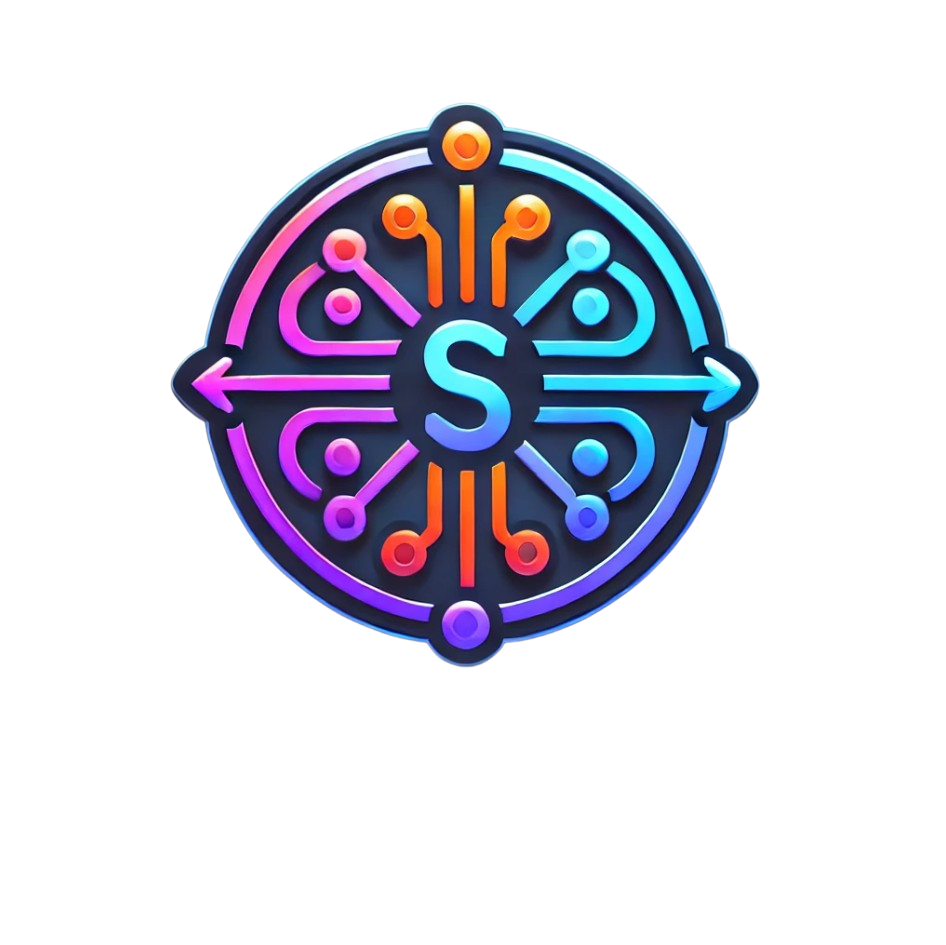

# SellSync - Gestão de Vendas e Estoque

    

Estou desenvolvendo um sistema de Gestão de Vendas e Estoque em Java, utilizando o NetBeans IDE com Maven para gerenciamento de dependências e o MySQL Workbench para modelagem e administração do banco de dados. O projeto possui bibliotecas como Reflections (para manipulação dinâmica de classes), Lombok (para simplificação do código) e o MigLayout (para um layout flexível e responsivo). O intuito do sistema é oferecer uma solução mais eficiente e intuitiva para o controle de produtos, pedidos e movimentação de estoque.
